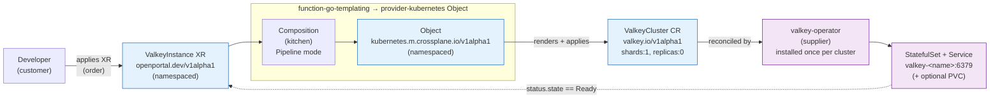

# Spec: Valkey Service (Crossplane)

| | |
|---|---|
| **Status** | Draft — for PO review |
| **PO / Owner** | Michael (michaelstingl) |
| **Date** | 2026-06-26 |
| **Scope** | MVP, KISS — single Valkey instance, self-service via Crossplane |
| **Backstage** | Out of scope for now (Crossplane-first) |

## 1. Goal

Let developers self-service a **Valkey** instance (Redis-compatible in-memory key/value store) through Crossplane: order a namespaced XR, get a running, connectable Valkey. Backstage form integration comes later — first make it work via Crossplane.

Restaurant analogy:

- **Menu** = `Valkey` XRD
- **Kitchen** = Composition
- **Supplier** = `valkey-operator`
- **Order** = the XR

## 2. Operator decision (confirmed)

Build on the **official `valkey-io/valkey-operator`** (`valkey.io/v1alpha1`, chart `valkey/valkey-operator`). Chosen deliberately per the platform's "latest + greatest" philosophy. It is **WIP** (`v1alpha1` may change, "not for production") — acceptable for our local/dev platform.

Key constraint (validated): the operator is **cluster-mode only** — there is no true standalone. The smallest unit is `ValkeyCluster{shards:1, replicas:0}` → a single pod running in cluster mode. For our MVP this *is* the "single instance".

> Alternatives (hyperspike, SAP) only if a real single-node / simple-password mode becomes a hard requirement. Not now.

## 3. User-facing API (XRD)

- **Kind:** `ValkeyInstance`
- **Group:** `openportal.dev`, **version** `v1alpha1`
- **Scope:** `Namespaced` (Crossplane v2 — direct XR, no claim)

### MVP parameters (KISS — two knobs)

| Param | Type | Default | Maps to |
|---|---|---|---|
| `size` | enum `small\|medium\|large` | `small` | `ValkeyCluster.spec.resources` (requests+limits) |
| `persistence.enabled` | bool | `false` | selects `workloadType` / adds `persistence` |
| `persistence.size` | quantity | `1Gi` | `ValkeyCluster.spec.persistence.size` |

Size mapping (starting point, tune later):

| size | cpu req | mem req | mem limit |
|---|---|---|---|
| small | 50m | 128Mi | 256Mi |
| medium | 250m | 512Mi | 1Gi |
| large | 500m | 1Gi | 2Gi |

Everything else (`shards:1`, `replicas:0`, exporter default) is fixed/hidden in the Composition. **Auth is on by default** — the built-in `default` user is password-protected with an auto-generated password (see §4, D8). TLS, replicas, sharding are **not** exposed in the MVP.

### Status (surfaced on the XR)

- `ready` (bool) — derived from `ValkeyCluster status.state == Ready`
- `endpoint` — `valkey-<name>.<namespace>.svc.cluster.local:6379`
- `authSecret` — name of the generated Secret holding the app user's password

## 4. Behaviour (Composition)

Pipeline-mode Composition (matches existing templates):

1. `function-go-templating` generates a random password and renders a **Secret** for the app user; it is applied via **provider-kubernetes** `Object` with a **create-only** policy (`managementPolicies: ["Create","Observe"]`) so the password stays stable across reconciles.
2. `function-go-templating` renders a `ValkeyCluster` (valkey.io/v1alpha1) with `shards:1, replicas:0`, mapped `resources`, optional `persistence`, and the built-in `default` user password-protected via `spec.users[].passwordSecret` (`{name, keys:[password]}`).
3. Both the Secret and the `ValkeyCluster` are applied via **provider-kubernetes** `Object` (`kubernetes.m.crossplane.io/v1alpha1`, namespaced, like template-whoami).
4. Readiness keyed on the operator's `status.state == Ready` / `Ready` condition (`function-auto-ready` or explicit readiness check). **Do not** key on `ValkeyNode.status.role` — the spike found it reports `primary` even for replicas.

### Data flow



The operator is platform infrastructure (installed once, see §5), **not** created by the Composition — only the `ValkeyCluster` order is.

## 5. Operator installation (platform infra)

Install the operator **once per cluster** via `cluster-setup.sh`, exactly like cert-manager (idempotent Helm) — **not** inside the Composition (the operator is the "supplier", not part of an order):

`cluster-setup.sh` builds the operator from a **pinned upstream commit**
(`5ac4d51` = v0.2.0-12, which includes the probe-auth fix **#235**) and deploys
that image via the pinned Helm chart (`0.2.7`). Building from source is required
because password-protecting the `default` user needs #235 (probes auth as the
`_operator` system user) — and #235 is merged on `main` but not in any release
yet (latest is v0.2.0).

```bash
# cluster-setup.sh builds valkey-operator:5ac4d51, then:
helm upgrade --install valkey-operator valkey/valkey-operator \
  -n valkey-operator-system --create-namespace --version 0.2.7 \
  --set image.registry= --set image.repository=valkey-operator \
  --set image.tag=5ac4d51 --set image.pullPolicy=Never
```

**Revisit:** drop the build-from-source step and pin a chart version once a
release > v0.2.0 ships #235.

## 6. Out of scope (deferred)

Deferred for the MVP:

- Advanced ACL (multiple users, fine-grained permissions) — the MVP ships **one** password-protected app user (see §3, D8)
- TLS
- Replicas / HA / failover
- Sharded cluster
- Backup / restore
- Backstage form / scaffolder integration
- Custom `config` tuning

The XRD is designed so these can be added as optional params later without breaking changes.

## 7. Validation — spike results (2026-06-26, rancher-desktop)

> Full spike write-up (commands, raw output, gotchas): [valkey-spike-findings.md](./valkey-spike-findings.md). Summary below.

Already proven on a live cluster (Crossplane v2.0.0 + operator chart 0.2.7 / app v0.2.0):

- `ValkeyCluster{shards:1, replicas:0}` → **Ready / ClusterHealthy in ~15s**, 1 pod, `PING→PONG`, `SET/GET` ok.
- **Resource floor tiny** (real usage ~6m CPU / 18Mi RAM) — `small` is generous.
- **Persistence works end-to-end**: PVC `valkey-<name>-0-0-data` (local-path), data **survives pod restart**.
- **Default user `nopass +@all`** out of the box — but the MVP **password-protects the `default` user** (D8). Validated live on the operator built from #235: `NOAUTH` without the password, `PONG`/`SET`/`GET` with it, cluster healthy (16384 slots), XR `Ready`. On v0.2.0 this breaks (probe fails `NOAUTH`) — hence the pinned-commit build. TLS stays deferred.
- Objects: StatefulSet `valkey-<name>-0-0`, Service `valkey-<name>:6379`, ConfigMap, ACL secrets. Containers: `server` + `metrics-exporter` (:9121).

## 8. Decisions (resolved by PO, 2026-06-26)

- **D5 — XRD kind:** `ValkeyInstance` (neutral; covers cache *and* persistent store).
- **D6 — sizing:** `size` enum (`small|medium|large`) for the MVP; a raw `resources` override may be added later (non-breaking).
- **D7 — Valkey version:** use the **operator default** image — no pin and no `image` param in the MVP. Revisit if reproducibility becomes a requirement.
- **D8 — auth:** the MVP ships auth **on** by default — the built-in **`default`** user is password-protected with an **auto-generated password** stored in a Secret (surfaced as `status.authSecret`), wired via `ValkeyCluster.spec.users[].passwordSecret` (`{name, keys:[password]}`). Connecting requires the password (`NOAUTH` otherwise) — validated live. **Requires operator ≥ #235** (probes auth as the `_operator` system user); on the released v0.2.0, password-protecting `default` breaks cluster formation, so `cluster-setup.sh` builds the operator from a pinned commit (see §5). Advanced ACL/multi-user and TLS remain deferred.

## 9. Implementation outline

New repo **`template-valkey`** following [template-standards.md](../template-standards.md): `configuration/` package with `xrd.yaml`, `composition.yaml`, `rbac.yaml`, `examples/xr.yaml`, `crossplane.yaml`. Operator install added to `scripts/cluster-setup.sh` + `scripts/manifests/setup/`. Detailed steps go into a separate implementation plan (writing-plans).

## 10. References

- Spike findings (companion doc): [valkey-spike-findings.md](./valkey-spike-findings.md)
- Operator source (local): `_work/reference/valkey-io/valkey-operator/` (`api/v1alpha1/*_types.go`, `config/samples/`)
- Helm chart (local): `_work/reference/valkey-io/valkey-helm/`
- Existing pattern: `template-whoami/configuration/` (XRD + Pipeline Composition)
- Felix strawman (not yet pushed): `main/docs/specs/valkey-service.md` (his machine)
